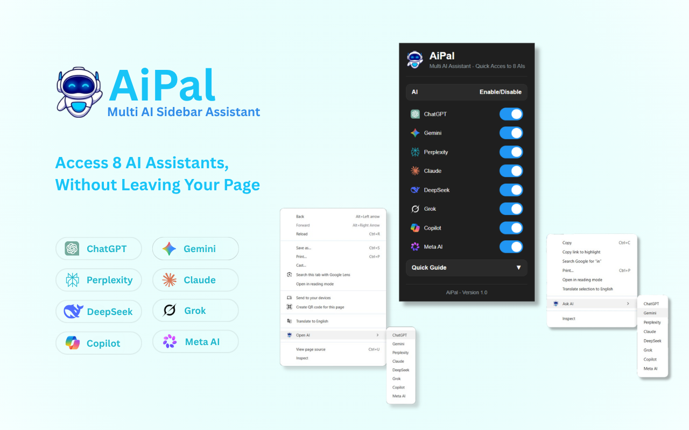
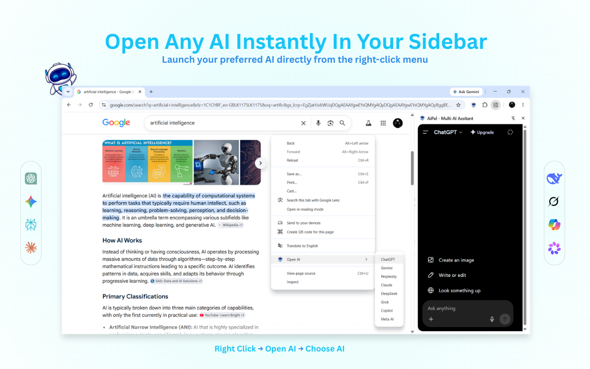
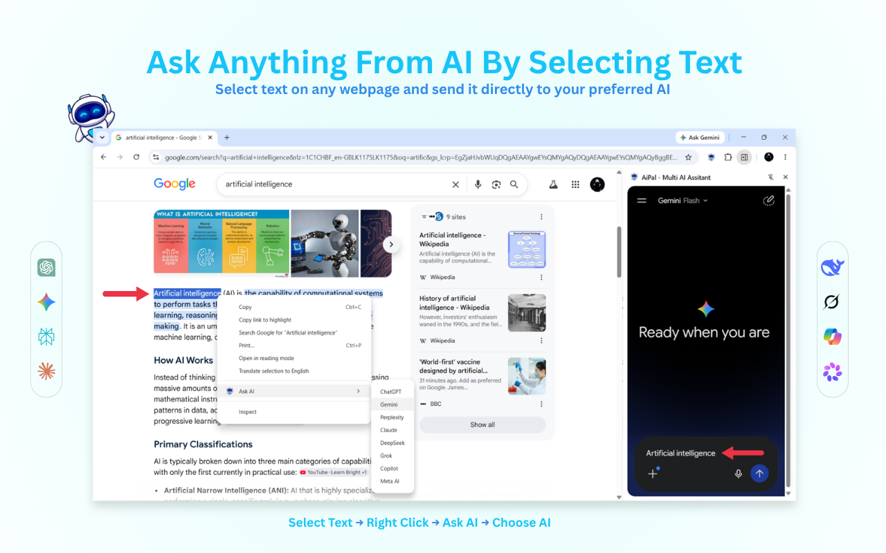
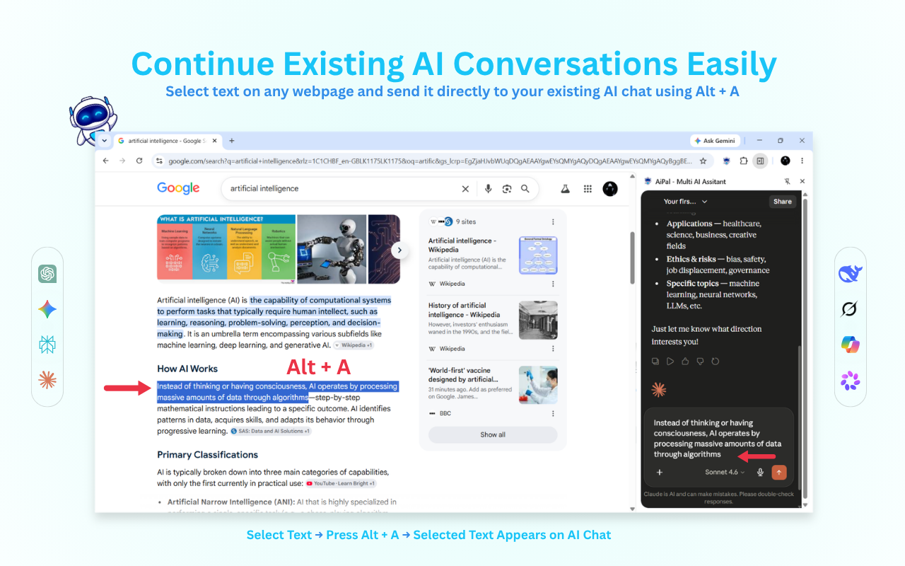
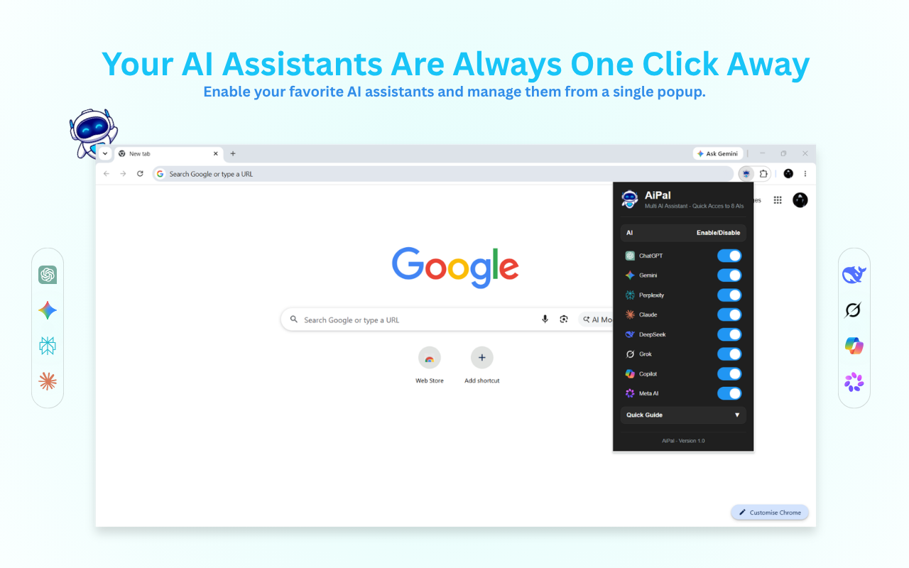

# 🤖 AiPal – Multi AI Sidebar Assistant for Chrome 🚀

  

**AiPal** is a productivity-focused Chrome Extension that brings **8 of the world's leading AI assistants directly into your browser's side panel**, allowing users to chat, research, write, code, and brainstorm without constantly switching tabs.

Built using **JavaScript, HTML, CSS, and Chrome Extension APIs**, AiPal provides a seamless way to access multiple AI services from one place while improving browsing and workflow efficiency.

⭐ Chrome Web Store Link - [AiPal](https://chromewebstore.google.com/detail/ghjbaeififjeacjfcpmfhboggbakopdm?utm_source=item-share-cb)

The extension combines several productivity-focused features including:

* Multi-AI Sidebar Integration
* Context Menu Actions
* Text Selection Support
* Keyboard Shortcuts
* Customizable AI Providers
* Chrome Side Panel API
* Persistent User Preferences

---

# Features Overview

## 🤖 Open AI - Multi-AI Side Panel

  

AiPal provides instant access to multiple AI assistants directly from Chrome's side panel.

Supported AI platforms include:

* ChatGPT
* Claude
* Gemini
* Perplexity
* DeepSeek
* Grok
* Copilot
* Meta AI

Users can instantly switch between AI services without opening new tabs or searching through bookmarks.

---

## ✨ Ask AI – Instant AI access by Selecting Text

  

The **Ask AI** feature allows users to instantly send selected webpage content(Text) to their preferred AI assistant in the sidebar.

Simply:

✔️ Highlight any text on a webpage  
✔️ Right-click and select **Ask AI**  
✔️ Continue your workflow with AI-generated responses instantly  

This makes researching, summarizing, explaining, and learning significantly faster.

---

## ⌨️ Alt + A - Keyboard Shortcut Support

  

AiPal includes a powerful productivity shortcut:

### Alt + A

Users can:

✔️ Select text anywhere on a webpage  
✔️ Press **Alt + A**  
✔️ Continue an existing conversation with the selected AI assistant instantly  

This provides one of the fastest ways to interact with AI while browsing.

---

## ⚙️ Customizable Extension Popup

  

The extension popup allows users to personalize their experience.

Users can:

✔️ Enable individual AI providers  
✔️ Disable services they don't use  
✔️ Create a cleaner and more focused workflow  
✔️ Save preferences automatically  

The extension remembers user preferences and adapts the interface accordingly.

---

# 🛠️ Technologies Used

- JavaScript (ES6)
- HTML5
- CSS3
- Chrome Extension Manifest V3
- Chrome Side Panel API
- Context Menus API
- Storage API
- Commands API
- Tabs API
- Runtime Messaging API
- Scripting API
- Declarative Net Request API

---

# 🧠 Technical Architecture & Implementation

AiPal is built as a **Manifest V3 Chrome Extension** with a modular multi-layer architecture designed for real-time AI interaction across different web platforms.

### 🧩 Background Service Worker (Core Controller)
The background script handles all central logic including:

- Dynamic creation of context menus based on enabled AI services
- “Ask AI” and “Open AI” nested menu system
- User preference syncing using `chrome.storage.sync`
- Side panel initialization using `chrome.sidePanel`
- Keyboard shortcut handling via `chrome.commands`
- Cross-tab communication and script injection using `chrome.scripting`

---

### 🖱️ Context Menu System (Dynamic AI Router)

AiPal dynamically generates context menu items for each AI provider:

- “Ask AI” (selection-based interaction)
- “Open AI” (page-level launch)

Each AI service is rendered dynamically based on user settings, allowing full customization without reloads.

---

### 🧠 Content Script (AI Interaction Engine)

The content script acts as a **universal AI automation layer** that:

- Detects supported AI websites (ChatGPT, Claude, Gemini, Perplexity, etc.)
- Automatically finds correct input fields per platform
- Injects selected or live text into AI interfaces
- Handles platform-specific UI differences

It includes advanced DOM handling techniques such as:

- MutationObserver-based element detection
- Framework-safe input clearing using prototype-level setters
- Retry and recovery logic for unstable AI interfaces (e.g., Perplexity, Meta AI)

---

### ⚡ Keyboard Shortcut System (Alt + A)

- Implemented using `chrome.commands`
- Enables instant text continuation across AI platforms
- Uses message passing between background and content scripts
- Falls back to script injection when content script is unavailable

---

### 🔁 State Management & Communication

AiPal uses a hybrid state system:

- `chrome.storage.sync` → user preferences (enabled AI providers)
- `chrome.storage.local` → session state (selected text, active AI)
- `chrome.runtime.onMessage` → live communication between scripts

---

### 🛡️ Declarative Net Request (Compatibility Layer)

Uses `declarativeNetRequest` rules to modify response headers for supported AI domains, ensuring:

- Proper embedding in side panel environment
- Removal of restrictive framing policies (CSP, X-Frame-Options, etc.)
- Seamless multi-site AI integration

---

### 🌐 Cross-Site AI Support Layer

AiPal supports multiple AI platforms through a unified abstraction layer:

- ChatGPT
- Claude
- Gemini
- Perplexity
- DeepSeek
- Grok
- Copilot
- Meta AI

Each platform is mapped to custom selectors and interaction logic for consistent behavior.

---

# 🔒 Privacy

AiPal:

✔️ Requires no additional account  
✔️ Does not collect or store personal data  
✔️ Does not track browsing activity  
✔️ Works directly with official AI services in your browser  

---

# 🚀 Installation

## From Chrome Web Store

1. Open the Chrome Web Store listing - [AiPal](https://chromewebstore.google.com/detail/ghjbaeififjeacjfcpmfhboggbakopdm?utm_source=item-share-cb)
2. Click **Add to Chrome**.
3. Pin the extension to your toolbar.
4. Sign in to your preferred AI services.
5. Start using AiPal.

---

# 💡 Why I Built This Project

As someone who frequently uses multiple AI assistants for studying, coding, researching, and writing, I found myself constantly switching between tabs and AI websites.

AiPal was built to solve this problem by creating a single productivity hub that brings the world's leading AI assistants directly into the browser sidebar, making AI interactions significantly faster and more convenient.

---

# 📚 What I Learned From This Project

Through this project I gained hands-on experience with:

- Building production-ready Chrome Extensions
- Working with Manifest V3 and Browser APIs
- Developing Side Panel applications
- Implementing Context Menus and Keyboard Commands
- Managing extension state and user preferences
- Handling cross-page communication
- Designing productivity-focused user experiences
- Publishing software on the Chrome Web Store
- Navigating the Chrome Extension review process

---

# ⭐ Chrome Web Store

If you find [AiPal](https://chromewebstore.google.com/detail/ghjbaeififjeacjfcpmfhboggbakopdm?utm_source=item-share-cb) useful, feel free to install it, share it, and leave a review on the Chrome Web Store.

Made with ❤️ to make AI workflows faster and more convenient.
